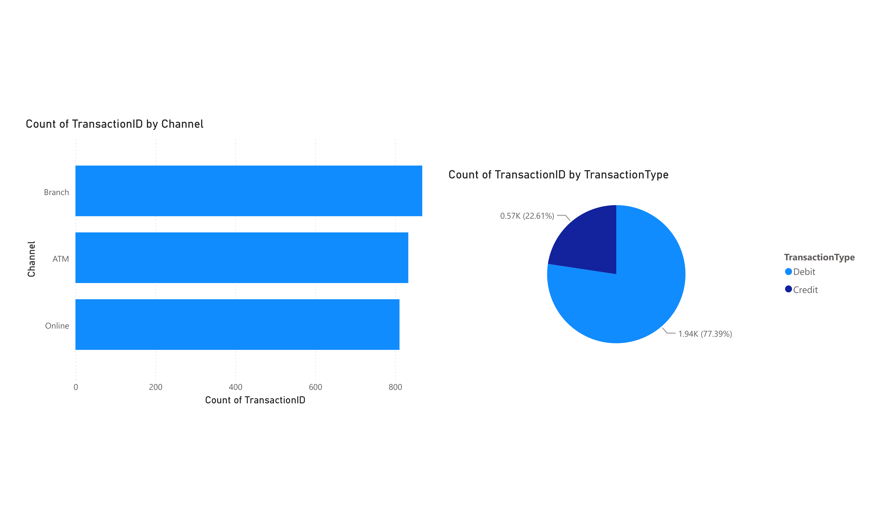
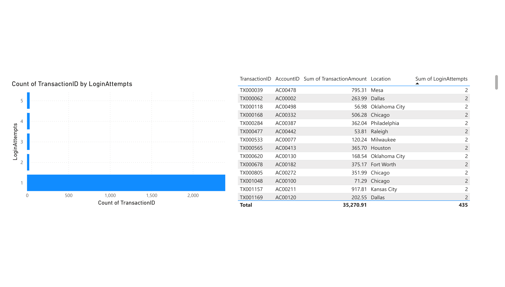
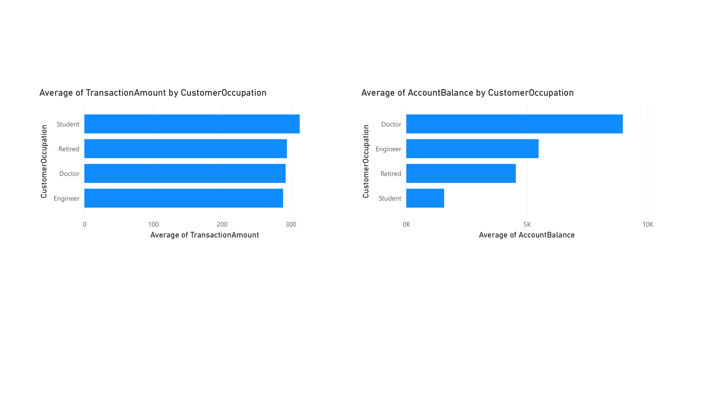
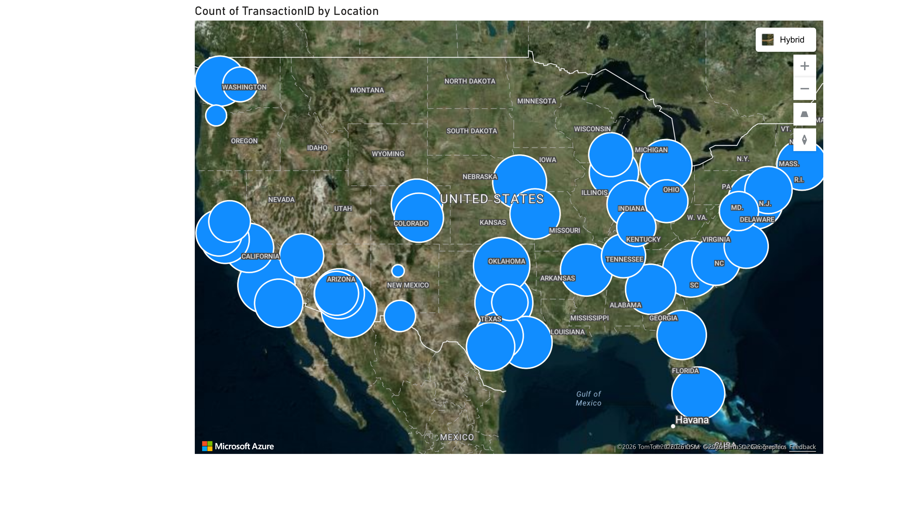

# 🏦 DataAnalysisBanking
### Microsoft Fabric | PySpark | Power BI

This is a personal project I built to learn Microsoft Fabric from scratch. I wanted to get hands-on experience with lakehouses, PySpark, and Power BI all in one place, so I grabbed a banking dataset from Kaggle and just started exploring.

The dataset has 2,512 bank transactions and I used it to look into things like fraud indicators, spending patterns by occupation, and where transactions are happening across the US.

---

## What I did

- Set up a Lakehouse in Microsoft Fabric and loaded the dataset
- Ran SQL queries through the SQL Analytics Endpoint
- Did the main analysis in a PySpark Notebook (aggregations, filters, joins)
- Built a multi-page Power BI report with interactive visualizations

---

## Dataset

**Source:** [Bank Transaction Dataset for Fraud Detection – Kaggle](https://www.kaggle.com/datasets/valakhorasani/bank-transaction-dataset-for-fraud-detection)

| Feature | Description |
|---|---|
| TransactionID | Unique transaction identifier |
| AccountID | Account identifier |
| TransactionAmount | Monetary value of transaction |
| TransactionDate | Timestamp of transaction |
| TransactionType | Credit or Debit |
| Location | U.S. city |
| Channel | ATM / Branch / Online |
| CustomerAge | Age of account holder |
| CustomerOccupation | Doctor / Engineer / Student / Retired |
| LoginAttempts | Number of login attempts (fraud indicator) |
| AccountBalance | Balance post-transaction |

---

## What I found

- 77% of transactions are Debit, ATM is almost exclusively used for withdrawals
- Students have the highest average transaction amount (aprox $313) but the lowest account balance (aprox $1,570), which is a weird pattern
- Doctors hold way more in their accounts ($8,979 avg) but don't necessarily spend more
- Around 5% of transactions have more than 1 login attempt, that's the main fraud signal I looked at
- 122 suspicious transactions flagged with LoginAttempts ≥ 2, totaling $35,270
- Online is the most balanced channel between Debit and Credit, unlike ATM which is almost exclusively used for withdrawals
- Higher login attempts don't necessarily mean higher transaction amounts, the averages are pretty similar across all groups, so amount alone isn't a great fraud indicator
- Jacksonville has the highest average login attempts across all cities, which could be worth investigating
- Branch has the highest total transaction count out of the three channels
- Students spend the most relative to their balance, on average they transact about 20% of their account balance per transaction, way more than any other occupation
- Debit transactions outnumber Credit across every single channel, which suggests most customers use the bank primarily for spending rather than receiving money
- The total amount tied to suspicious transactions ($35,270) represents about 4.7% of overall transaction volume, small percentage but non-trivial at scale

---

## Power BI Report

**Page 1 – Channel & Transaction Type**
Bar chart + pie chart showing how transactions are split across ATM, Branch, Online and between Debit/Credit.



**Page 2 – Fraud Indicators**
Login attempts distribution and a table of suspicious transactions sorted by login attempts.



**Page 3 – Occupation Analysis**
Side by side comparison of average transaction amount vs average account balance by occupation.



**Page 4 – Geographic Distribution**
Azure Map with bubble size showing transaction count per US city.



---

## Repo structure

```
├── bank_transactions_analysis.ipynb   # PySpark notebook
├── bank_transactions_clean.csv        # Cleaned dataset
└── README.md
```

---

## How to run

1. Upload `bank_transactions_clean.csv` to a Microsoft Fabric Lakehouse
2. Load it as a table named `bank_transactions`
3. Open `bank_transactions_analysis.ipynb` in a Fabric Notebook and run all cells

---

## Stack

- **Microsoft Fabric** - Lakehouse, SQL Analytics Endpoint, Notebooks
- **PySpark** - data loading, aggregations, filtering
- **Pandas** - tabular display via `.toPandas()`
- **Matplotlib + NumPy** - visualizations
- **Power BI** - interactive dashboard
